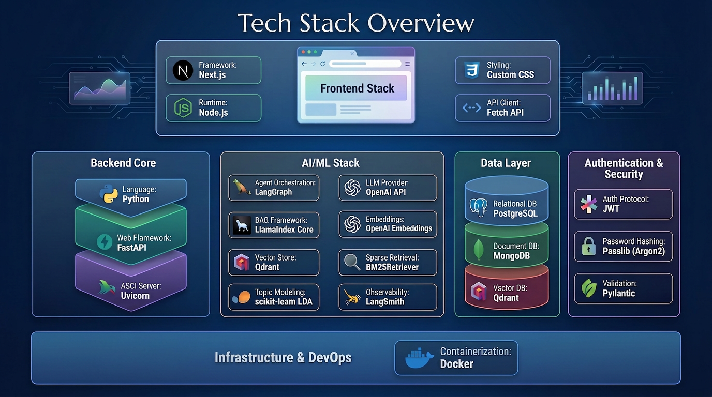
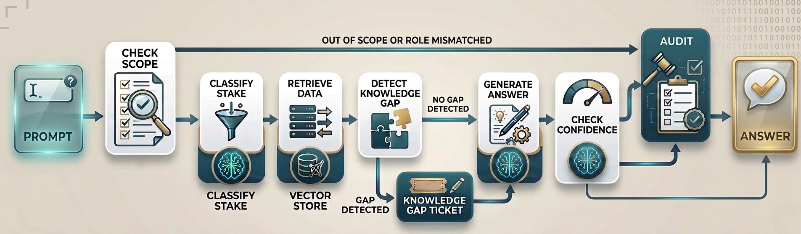

# DelibRAG - Deliberative Agentic RAG System

A multi-user, role-aware, agentic RAG (Retrieval-Augmented Generation) platform designed for team knowledge bases with built-in knowledge gap management, stakes-aware answering, and self-updating retrieval capabilities.

## Table of Contents

- [Overview](#overview)
- [Key Features](#key-features)
- [System Architecture](#system-architecture)
- [Technology Stack](#technology-stack)
- [Project Structure](#project-structure)
- [Getting Started](#getting-started)
- [How the Agent Works](#how-the-agent-works)
- [Knowledge Gap Management](#knowledge-gap-management)
- [Stakes-Aware Retrieval](#stakes-aware-retrieval)
- [Role-Based Access Control](#role-based-access-control)
- [API Documentation](#api-documentation)


## Overview

DelibRAG is an **intelligent RAG system** that goes beyond simple question-answering. It combines:

- **Standard Q&A (Read Loop)** — Hybrid BM-25 + vector retrieval over hierarchically indexed knowledge bases
- **Knowledge Gap Management (Write Loop)** — Automatic detection of unanswerable or contradictory queries, generating structured gap tickets for human resolution
- **Self-Updating Retrieval (Learn Loop)** — Ingesting human-resolved tickets back into the index, updating source trust scores
- **Stakes-Aware Answering (Honest Broker)** — Classifying queries by consequence severity and applying proportional retrieval rigor, confidence gating, and audit trails
- **Out-of-Scope Detection** — LDA-based topic modeling with per-query scope classification

The system is designed for organizations that need reliable, auditable, and continuously improving knowledge management with role-based access control.


## Key Features

### 🔍 Intelligent Retrieval
- **Hybrid Search**: Combines BM-25 (sparse) and vector (dense) retrieval with reciprocal rank fusion
- **Hierarchical Indexing**: Multi-level document chunking (large/medium/small) with automatic merging
- **Entity-Based Filtering**: Extracts and filters nodes based on query entities
- **Trust Score Ranking**: Prioritizes sources based on historical accuracy and resolution feedback

### 🎯 Stakes-Aware Processing
- **Automatic Stakes Classification**: Analyzes query complexity, user role, and consequence severity
- **Tiered Retrieval Pipelines**:
  - **Low Stakes**: Fast single-hop retrieval with minimal overhead
  - **High Stakes**: Multi-source retrieval with contradiction detection and confidence gating
- **Confidence Thresholds**: Blocks low-confidence answers on high-stakes queries, requiring human review

### 📋 Knowledge Gap Management
- **Automatic Gap Detection**: Identifies missing knowledge, contradictions, and low-confidence scenarios
- **Structured Ticketing**: Creates actionable tickets with query context, gap type, and suggested owners
- **Resolution Ingestion**: Automatically indexes resolved content and updates trust scores
- **Learn Loop**: Continuously improves retrieval quality based on gap resolutions

### 🔐 Role-Based Access Control
- **Multi-Role Support**: Clinician, Manager, Admin roles with department-based access
- **Metadata Filtering**: Retrieval respects role and department permissions at the node level
- **Role-Topic Mismatch Detection**: Prevents cross-domain queries (e.g., clinical users asking management questions)

### 📊 Audit & Tracing
- **Full Audit Trails**: High-stakes queries log retrieval paths, evidence, contradictions, and confidence scores
- **LangSmith Integration**: Optional distributed tracing for debugging and monitoring
- **Session Management**: Persistent chat history with automatic title generation


## Technology Stack



### Backend Core

| Component | Technology | Version | Purpose |
|-----------|-----------|---------|---------|
| **Web Framework** | FastAPI | 0.109.2 | Async REST API with automatic OpenAPI docs |
| **ASGI Server** | Uvicorn | 0.27.1 | High-performance async server with hot reload |
| **Language** | Python | 3.11+ | Type hints, async/await, dataclasses |

### AI/ML Stack

| Component | Technology | Version | Purpose |
|-----------|-----------|---------|---------|
| **Agent Orchestration** | LangGraph | Latest | State machine for multi-step RAG workflows |
| **RAG Framework** | LlamaIndex Core | Latest | Document indexing, retrieval, metadata extraction |
| **LLM Provider** | OpenAI API | Latest | GPT models for generation (configurable: gpt-5-nano) |
| **Embeddings** | OpenAI Embeddings | Latest | text-embedding-3-small (1536 dimensions) |
| **Vector Store** | Qdrant | 1.17.1 | High-performance vector similarity search |
| **Sparse Retrieval** | BM25Retriever | (LlamaIndex) | Keyword-based retrieval for hybrid search |
| **Topic Modeling** | scikit-learn LDA | Latest | Out-of-scope detection via Latent Dirichlet Allocation |
| **Observability** | LangSmith | Latest | Distributed tracing, debugging, monitoring (optional) |

### Data Layer

| Component | Technology | Version | Purpose |
|-----------|-----------|---------|---------|
| **Relational DB** | PostgreSQL | 16 | User accounts, gap tickets, trust scores, routing preferences |
| **Document DB** | MongoDB | 7 | Chat sessions, conversation history, audit trails |
| **Vector DB** | Qdrant | 1.17.1 | Vector embeddings with metadata filtering |


### Authentication & Security

| Component | Technology | Version | Purpose |
|-----------|-----------|---------|---------|
| **Auth Protocol** | JWT | - | Stateless authentication with access/refresh tokens |
| **Password Hashing** | Passlib (Argon2) | 1.7.4 | Secure password hashing with Argon2id |
| **Validation** | Pydantic | 2.8+ | Request/response validation with type safety |

### Frontend Stack

| Component | Technology | Version | Purpose |
|-----------|-----------|---------|---------|
| **Framework** | Next.js | 14.2.18 | React framework with App Router, SSR, streaming |
| **Runtime** | Node.js | 20 LTS | JavaScript runtime |
| **Styling** | Custom CSS | - | Responsive design with CSS |
| **API Client** | Fetch API | Native | RESTful API calls with automatic token refresh |

### Infrastructure & DevOps

| Component | Technology | Version | Purpose |
|-----------|-----------|---------|---------|
| **Containerization** | Docker | Latest | Application containerization |


## Project Structure

```
delibrag/
├── backend/                         # Python / FastAPI
│   ├── agent/                       # LangGraph agent implementation
│   │   ├── graph.py                 # State machine definition
│   │   ├── nodes.py                 # Node implementations (retrieve, answer, etc.)
│   │   ├── state.py                 # AgentState TypedDict
│   │   ├── memory.py                # Session memory (MongoDB)
│   │   ├── stakes_classifier.py     # Stakes-aware classification
│   │   ├── confidence_gate.py       # Confidence threshold logic
│   │   ├── router.py                # /chat, /stream endpoints
│   │   └── tracing.py               # LangSmith configuration
│   │
│   ├── auth/                        # Authentication & authorization
│   │   ├── router.py                # /register, /login, /refresh
│   │   ├── models.py                # User models
│   │   ├── service.py               # Password hashing, JWT
│   │   └── dependencies.py          # get_current_user, require_role
│   │
│   ├── indexing/                    # Document indexing pipeline
│   │   ├── pipeline.py              # HierarchicalNodeParser + metadata
│   │   ├── metadata_extractors.py   # SummaryExtractor, EntityExtractor
│   │   ├── scope_manifest.py        # LDA topic extraction
│   │   ├── trust_scores.py          # Source trust management
│   │   └── router.py                # /index, /reindex endpoints
│   │
│   ├── retrieval/                   # Hybrid retrieval system
│   │   ├── hybrid_retriever.py      # BM-25 + vector + AutoMerging
│   │   ├── scope_classifier.py      # LDA-based scope detection
│   │   ├── entity_filter.py         # Entity-based node filtering
│   │   └── context_builder.py       # Context string assembly
│   │
│   ├── knowledge_gap/               # Knowledge gap management
│   │   ├── detector.py              # Gap detection logic
│   │   ├── ticket_manager.py        # CRUD for gap tickets
│   │   ├── resolution_ingestion.py  # Ingest resolved docs
│   │   └── router.py                # /gaps endpoints
│   │
│   ├── audit/                       # Audit trail system
│   │   ├── trail.py                 # Audit entry writer (MongoDB)
│   │   └── router.py                # /audit endpoints
│   │
│   ├── db/                          # Database connections
│   │   ├── postgres.py              # SQLAlchemy async engine
│   │   └── mongo.py                 # Motor async client
│   │
│   ├── main.py                      # FastAPI app entry point
│   ├── config.py                    # Settings (env vars)
│   ├── requirements.txt             # Python dependencies
│   └── Dockerfile                   # Backend container
│
├── frontend/                        # Next.js 14 (App Router)
│   ├── app/
│   │   ├── (auth)/                  # Auth pages
│   │   │   ├── login/page.tsx
│   │   │   └── register/page.tsx
│   │   ├── chat/                    # Chat interface
│   │   │   ├── page.tsx
│   │   │   └── [sessionId]/page.tsx
│   │   ├── admin/                   # Admin dashboards
│   │   │   ├── gaps/page.tsx        # Knowledge gap tickets
│   │   │   ├── audit/page.tsx       # Audit trail viewer
│   │   │   └── index/page.tsx       # Index management
│   │   ├── layout.tsx               # Root layout
│   │   └── globals.css              # Global styles
│   │
│   ├── components/
│   │   ├── chat/
│   │   │   └── ChatWorkspace.tsx    # Main chat component
│   │   ├── gaps/                    # Gap management components
│   │   ├── audit/                   # Audit components
│   │   └── ProtectedShell.tsx       # Auth wrapper
│   │
│   ├── lib/
│   │   ├── api.ts                   # API client functions
│   │   ├── auth.ts                  # Token management
│   │   └── types.ts                 # TypeScript types
│   │
│   ├── package.json
│   ├── tsconfig.json
│   └── Dockerfile
│
├── infra/
│   ├── postgres/
│   │   └── init.sql                 # Database schema
│   └── qdrant/                      # Qdrant storage (persistent)
│
├── scripts/                         # Utility scripts
│   ├── run_llamaindex.py            # Index documents
│   └── lda_domains/                 # LDA models per department
│       ├── clinical/
│       └── manager/
│
├── docker-compose.yml               # Multi-container orchestration
├── .env.example                     # Environment variables template
├── implementation_plan.md           # Detailed implementation guide
└── README.md                        # This file
```


## Getting Started

### Prerequisites

- Docker & Docker Compose
- OpenAI API key
- (Optional) LangSmith API key for tracing

### Installation

1. **Clone the repository**
   ```bash
   git clone <repository-url>
   cd delibrag
   ```

2. **Set up environment variables**
   ```bash
   cp .env.example .env
   ```
   
   Edit `.env` and configure:
   ```env
   # Required
   OPENAI_API_KEY=sk-...
   JWT_SECRET=your-secret-key-here
   
   # Optional
   LANGSMITH_API_KEY=ls__...
   LANGSMITH_PROJECT=delibrag
   LANGSMITH_TRACING_ENABLED=true
   
   # Database credentials (defaults are fine for development)
   POSTGRES_PASSWORD=delibpass
   ```

3. **Start the services**
   ```bash
   docker-compose up -d
   ```

   This will start:
   - Backend API: http://localhost:8000
   - Frontend UI: http://localhost:3000
   - PostgreSQL: localhost:5432
   - MongoDB: localhost:27017
   - Qdrant: http://localhost:6333

4. **Index sample documents**
   ```bash
   docker-compose exec backend python scripts/run_llamaindex.py
   ```

5. **Access the application**
   - Open http://localhost:3000
   - Register a new account
   - Start chatting with your knowledge base!


## How the Agent Works



DelibRAG uses a **LangGraph state machine** to orchestrate the RAG pipeline. The agent follows this overview flow:


**Node Execution Flow:**

1. **load_history** → Load conversation history from MongoDB
2. **scope_check** → Classify query scope and check role-topic alignment
   - If `role_topic_mismatch` → **role_mismatch_response** → audit_log
   - If `out_of_scope` → **out_of_scope_response** → audit_log
   - If `in_scope` → Continue to **stakes_classify**
3. **stakes_classify** → Determine stakes level (low/high)
   - If `low` → **low_stakes_retrieve** (single-hop BM-25 + vector)
   - If `high` → **high_stakes_retrieve** (multi-query + contradiction detection)
4. **gap_detect** → Check for missing knowledge or contradictions
5. **gap_ticket_create** → Create ticket if gap was detected
6. **answer_generate** → Generate LLM response with citations
7. **confidence_check** → Evaluate confidence against threshold
8. **audit_log** → Write audit trail (high-stakes queries only)
9. **memory_save** → Persist conversation to MongoDB
10. **END**


## Knowledge Gap Management

### Gap Detection Triggers

The system automatically detects knowledge gaps in three scenarios:

1. **Missing Knowledge** (Condition A)
   - Query is in-scope but retrieval returns no relevant nodes
   - Relevance score below threshold (default: 0.2)

2. **Contradiction** (Condition B)
   - Retrieved nodes contain conflicting claims about the same entity
   - LLM-based contradiction detection on top-5 nodes

3. **Low Confidence** (Condition C)
   - Query is in-scope but LLM confidence is below threshold
   - Only applies to high-stakes queries (threshold: 0.45)


### Resolution Workflow

1. **Assign Ticket**: Admin/manager assigns to knowledge owner
2. **Resolve Gap**: Knowledge owner provides resolution:
   - **Add Document**: Upload new document or provide text
   - **Update Document**: Replace existing document
   - **Deprecate**: Mark conflicting sources as deprecated
3. **Automatic Ingestion**: System re-indexes content with metadata
4. **Trust Score Update**: Increment trust for resolving department's sources
5. **Close Ticket**: Mark as resolved with timestamp and resolver ID


## Stakes-Aware Retrieval

### Stakes Classification Matrix

Stakes are determined by three signals:

| Query Complexity | Role Sensitivity | Consequence Severity | Stakes Level |
|------------------|------------------|---------------------|--------------|
| single_hop       | low              | low                 | **low**      |
| single_hop       | low              | medium              | **medium**   |
| single_hop       | high             | high                | **high**     |
| multi_hop        | any              | medium              | **high**     |
| multi_hop        | any              | high                | **high**     |

**Consequence Keywords** (high severity):
- deploy, production, security, compliance, GDPR
- delete, migrate, customer data, incident, legal

**Sensitive Roles**: manager, admin

### Tiered Retrieval Pipelines

| Stakes Level | Retrieval Strategy | Confidence Gate | Audit Trail |
|--------------|-------------------|-----------------|-------------|
| **Low**      | Single-hop BM-25 fallback | None (0.0) | No |
| **High**     | Multi-source hybrid + contradiction detection | 0.75 | Yes (full) |


## Role-Based Access Control

### User Roles

| Role       | Permissions |
|------------|-------------|
| **clinician** | Ask questions (clinical domain) |
| **manager**   | Ask questions (management domain), view/resolve gap tickets, view audit trails |
| **admin**     | Full access: manage users, trigger reindex, view/resolve gap tickets, view all audit trails |

### Department-Based Retrieval

Each document node carries metadata:
```python
{
    "allowed_roles": ["clinician", "admin"],
    "department": "clinical",
    "uploaded_by_role": "clinician",
    "source_trust_score": 1.0,
    "is_deprecated": False
}
```

Retrieval automatically filters nodes:
```python
filters=MetadataFilters(filters=[
    MetadataFilter(key="allowed_roles", value=user.role),
    MetadataFilter(key="department", value=user.department),
    MetadataFilter(key="is_deprecated", value=False)
])
```

### Role-Topic Mismatch Prevention

The system prevents cross-domain queries:
- **Clinical users** asking **management questions** → Blocked
- **Management users** asking **clinical questions** → Blocked
- **Admin users** → No restrictions

This prevents inappropriate gap tickets from being created when users ask questions outside their domain.


## Configuration

### Environment Variables

| Variable | Description | Default |
|----------|-------------|---------|
| `OPENAI_API_KEY` | OpenAI API key (required) | - |
| `JWT_SECRET` | Secret for JWT signing | `changeme` |
| `DATABASE_URL` | PostgreSQL connection string | `postgresql+asyncpg://...` |
| `MONGO_URI` | MongoDB connection string | `mongodb://mongo:27017` |
| `QDRANT_HOST` | Qdrant host | `qdrant` |
| `QDRANT_PORT` | Qdrant port | `6333` |
| `LANGSMITH_API_KEY` | LangSmith API key (optional) | - |
| `LANGSMITH_TRACING_ENABLED` | Enable LangSmith tracing | `false` |

### Confidence Thresholds

Edit `backend/config.py`:
```python
confidence_threshold_low: float = 0.0   # No gate for low-stakes
confidence_threshold_high: float = 0.75 # High-stakes gate
gap_confidence_threshold: float = 0.45  # Gap detection threshold
gap_retrieval_score_threshold: float = 0.2  # Relevance threshold
```


## License

This project is licensed under the MIT License - see the LICENSE file for details.

